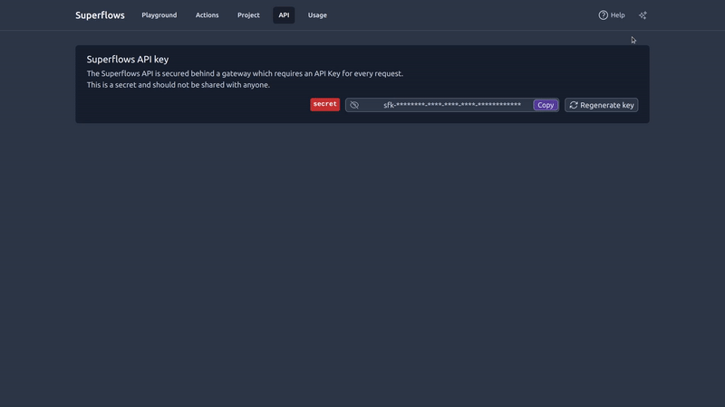

<br>
<p align="center">
  <a href="https://www.superflows.ai">
    
  </a>
</p>

<h2 align="center" >A chat interface that can control your product </h3>
<p align="center"></p>

<p align="center">🌐 <a href="https://superflows.ai">Website</a> · 📚 <a href="https://docs.superflows.ai">Docs</a> ·  💬 <a href="https://join.slack.com/t/superflowsusers/shared_invite/zt-1zf93teqq-0I9H_niiGruVDPFVSzGj9w">Slack</a></p>
<br />

https://github.com/Superflows-AI/superflows/assets/33871096/77c463c1-5e06-45a8-a32a-9f1fd8af0dac

# Superflows

Superflows makes it easy to add an AI assistant to a software product. This lets users ask questions in natural language and the assistant makes API calls to answer them.

E.g. a CRM user could ask: "What's the status of the B Corp deal?". A product analytics tool user could ask: "What did users think of the recent UI change?". These questions would be addressed by fetching information from your product's API and using an LLM to generate the answer.

You can try out the cloud version for free [**here**](https://dashboard.superflows.ai) or self-host. You can learn more on our [documentation pages](https://docs.superflows.ai/).


## Setup

Setup involves three steps:

1. Upload API specification
2. Test in the playground
3. Integrate into your product in 1 line of code

### Roadmap

[Available here.](https://docs.superflows.ai/blog/roadmap)

## Features

- Developer dashboard to configure and test your product assistant
- Public streaming API
- Answers in the same language the question is asked in
- UI components (find React components [here](https://github.com/Superflows-AI/chat-ui))
- Upload API specifications for fast set up
- Connect to multiple APIs with different hosts
- Track usage in dashboard

### Dashboard

Superflows has a testing dashboard where you can configure, evaluate and debug your AI assistant before putting it into production. 

You can interact with your assistant on the <b>'Playground'</b>. <b>'Developer mode'</b> shows you under the hood of what the assistant is thinking and planning. <b>'Mock API responses'</b> enables you to check the behaviour of the assistant without connecting it to an API. 


The 'Actions' page lets you control which API endpoints your assistant can call to answer user queries in a simple dashboard.

These endpoints can easily be uploaded via an Open API Specification, or entered manually. 


### API

Our API specification can be found at on our [documentation page](https://docs.superflows.ai/docs/category/api-specification). 

### UI Components

Superflows comes with out-of-the-box React UI components. These components let you integrate Superflows into your product in a few lines of code ([integration guide](https://docs.superflows.ai/docs/integration-guide/react)). 




## Development

You need to be running a local version of [Supabase](https://supabase.io) to develop this project locally.

[Here are comprehensive instructions on using the Supabase CLI](https://supabase.com/docs/guides/cli)

(note: if you have used Supabase in other projects before, you may have to `supabase stop` before running `supabase start`)

**If using `npm`**

```bash
npm i
npm install supabase --save-dev
npx supabase start
```
The 2nd command should give you an `anon_api_key` and a `service_role` key.

You'll need to enter these into the `.env` file. Check out `.env.example` for the format and variables required.

Once you fill in `.env.example`, rename it `.env`.

To run in development mode:

```bash
make run
```

(Alternatively, if you don't have `make`, use `npm run dev`)

