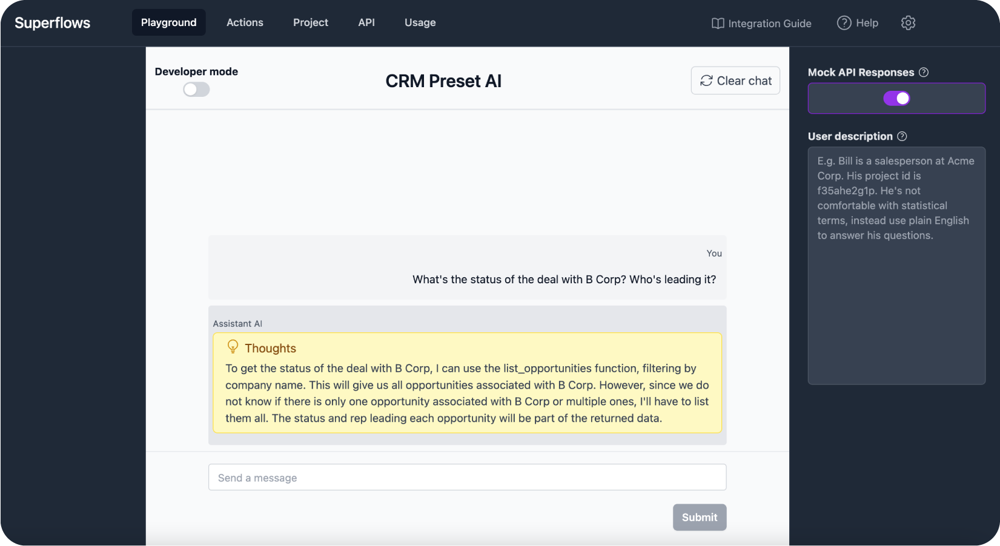

<br>
<p align="center">
  <a href="https://www.superflows.ai">
    
  </a>
</p>

<h2 align="center" >A chat interface that controls your product via API calls</h3>
<p align="center"></p>

<p align="center"><a href="https://superflows.ai">🌐 Website</a> · <a href="https://docs.superflows.ai">📚 Docs</a> · <a href="https://superflows.ai/crm-demo">🎮 Demo</a> · <a href="https://join.slack.com/t/superflowsusers/shared_invite/zt-1zf93teqq-0I9H_niiGruVDPFVSzGj9w">💬 Slack</a> ·  <a href="https://github.com/Superflows-AI/chat-ui">🖥 React Components</a></p>
<br />

https://github.com/Superflows-AI/superflows/assets/33871096/77c463c1-5e06-45a8-a32a-9f1fd8af0dac

# Superflows

Superflows makes it easy to add an AI assistant to a software product. This lets users ask questions in natural language and the assistant makes calls to the software's API to answer them.

E.g. a CRM user could ask simply:
> What's the status of the B Corp deal?

or more complex questions like:
> Which of my deals are at risk of slipping this quarter? What next steps would you recommend to get them back on track?

A user of feedback software could ask:
> Which bugs reported by users are the most pressing?

**Check out a demo of Superflows in a CRM [here](https://superflows.ai/crm-demo).**

You can try out the cloud version for free [**here**](https://dashboard.superflows.ai) or self-host. You can learn more on the [docs pages](https://docs.superflows.ai/).


## Setup

1. Upload API specification
2. Test in the playground
3. Integrate into your product in 1 line of code

## Features

- [x] Developer dashboard to configure and test your product assistant 🎛️
- [x] Public streaming API 🏞️
- [x] Answers in the same language the question is asked in 🇬🇧 🇪🇸 🇫🇷 🇩🇪
- [x] Pre-built UI components (find React components [here](https://github.com/Superflows-AI/chat-ui)) 🖥️
- [x] Upload API specifications for fast set up 💨
- [x] Connect to multiple APIs with different hosts ✌️
- [x] Asks for user confirmation before taking actions that add, remove or update data ✅ 
- [x] Track usage in dashboard 📊
- [x] Multi-LLM support (Llama 2, GPT4, Claude 2, PaLM 2...) 🌍
- [x] Collects user feedback on AI replies for fine-tuning 👍

### Dashboard

Superflows has a testing dashboard where you can configure, evaluate and debug your AI assistant before putting it into production. 

You can interact with your assistant on the <b>'Playground'</b>. <b>'Developer mode'</b> shows you under the hood of what the assistant is thinking and planning. <b>'Mock API responses'</b> enables you to check the behaviour of the assistant without connecting it to an API. 



The <b>'Actions'</b> page lets you control which API endpoints your assistant can call to answer user queries in a simple dashboard.

These endpoints can easily be uploaded via an Open API Specification, or entered manually. 


### UI Components

Superflows comes with out-of-the-box React UI components. These components let you integrate Superflows into your product in 1 line of code ([integration guide](https://docs.superflows.ai/docs/integration-guide/react)). 


### API

The API specification can be found in the [docs](https://docs.superflows.ai/docs/category/api-specification). 


## Support / talk with founders
- [Schedule Demo 👋](https://meetings-eu1.hubspot.com/matthew-phillips/superflows-demo)
- [Slack Community 💭](https://join.slack.com/t/superflowsusers/shared_invite/zt-1zf93teqq-0I9H_niiGruVDPFVSzGj9w)
- Our numbers 📞 +44 (755) 7101-159 / +44 (780) 580-6766
- Our emails ✉️ [henry@superflows.ai](mailto:henry@superflows.ai?cc=matthew@superflows.ai&subject=Chat+about+Superflows) / [matthew@superflows.ai](mailto:matthew@superflows.ai?cc=henry@superflows.ai&subject=Chat+about+Superflows)

## Self-hosting

We haven't written a self-hosting guide for Superflows yet. If you're interested in self-hosting, please reach out to us on [Slack](https://join.slack.com/t/superflowsusers/shared_invite/zt-1zf93teqq-0I9H_niiGruVDPFVSzGj9w) or [email](mailto:henry@superflows.ai?cc=matthew@superflows.ai&subject=Interested+in+self-hosting).

## Roadmap

[Available here.](https://docs.superflows.ai/blog/roadmap)

## Development

You need to be running a local version of [Supabase](https://supabase.io) to develop this project locally.

[Here are comprehensive instructions on using the Supabase CLI](https://supabase.com/docs/guides/cli)

(note: if you have used Supabase in other projects before, you may have to `supabase stop` before running `supabase start`)

**If using `npm`**

```bash
npm i
npm install supabase --save-dev
npx supabase start
```
The 2nd command should give you an `anon_api_key` and a `service_role` key.

You'll need to enter these into the `.env` file. Check out `.env.example` for the format and variables required.

Once you fill in `.env.example`, rename it `.env`.

To run in development mode:

```bash
make run
```

(Alternatively, if you don't have `make`, use `npm run dev`)

